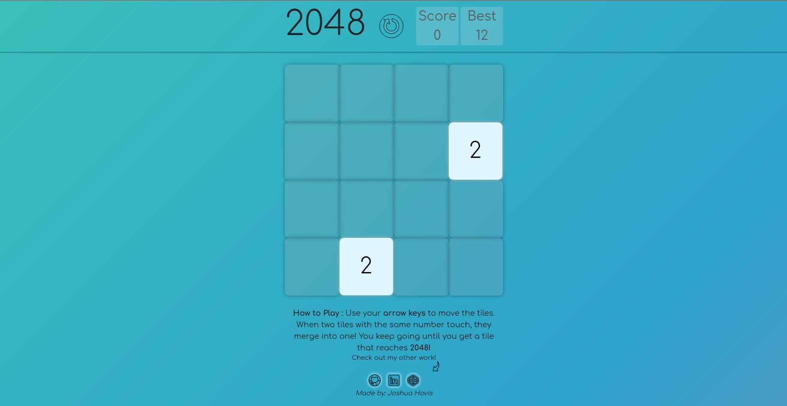
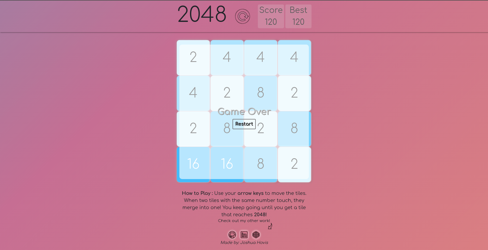

# 2048 Game
This is a rendition of the pupular game 2048 that premeried in 2014. The objective of the game is to move the tiles and combine tiles of the same value, in a 4x4 grid in order to reach a score of 2048! (You can also keep going past 2048 if you so choose.)

## Instructions for Gameplay
User will use the arrow keys to move the tiles on the board. All tiles on the board will move in the direction of the arrow key. If two tiles of the same value are moved and are next to each other then they will merge into one tile with a value of the sum of both tiles. The game ends either when the user decides to quit or there are no possible moves left. 

###### User Story
When the page first loads, there will be 2 squares on the grid already filled in with either 2 or 4. The user can start the game by just using the arrow keys to move the squares. Once you press the arrow keys then more squares will start to drop in.

###### Link To Game
https://joshhovis.github.io/2048-Web-Game/

###### Screenshots

###### Future Features
- Optimization for mobile and tablet devices
